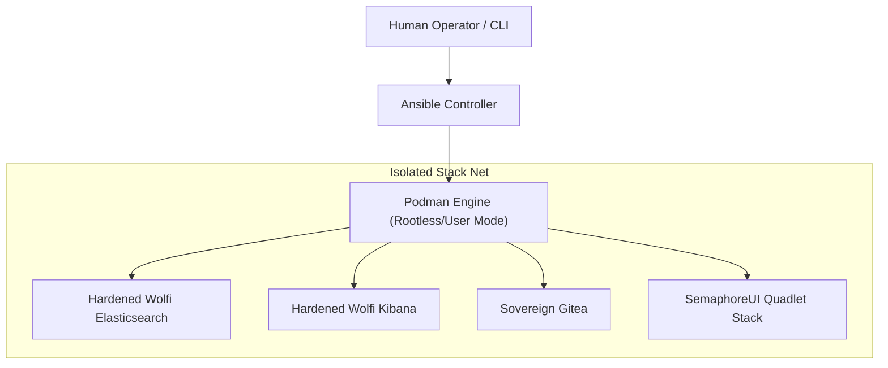

# Architecture Overview

This explanation guide outlines the core design goals, system boundaries, and structural elements of the deployment architecture.

---

## 🏛️ Component Boundaries

The project establishes three segregated operational layers:

---

## 🔒 Unprivileged & Rootless Execution

Standard setups often run container runtimes with root privileges, creating potential privilege-escalation risks.

Our project enforces a **Strict Zero-Privilege Rule**:
1. All container tasks are managed under standard user permissions via rootless Podman execution contexts.
2. Port binding ranges are shifted above privileged values (e.g. mapping internal ports securely to host ranges such as `3000` or `5601`).
3. Services utilize shared unprivileged user bridges to isolate database communication entirely from the default host network interface.
